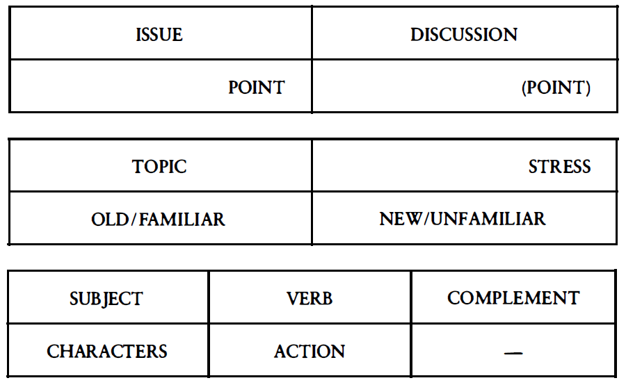

# Style-Note
Study notes of *Williams J M, Colomb G G. Style: Toward clarity and grace[M]. Chicago: University of Chicago Press, 1990.*

## The Model Entire
This model is built in the first six chapters of the book. It illustrats a strong relation between a word or a phrase's functionality and its **location** in a sentence. This relation consists in three levels in the architecture of a document.

## Three additional principles
basically on the **consistency** of topics and thematic strings in a paragraph.

1. In the issue, introduce key thematic and topical words in its stress.
2. In the discussion, keep strings of topics consistent.
3. In the discussion, repeat those thematic words or words related to them.

## A Final Note on Drafting
Harnssing the model and principles in the first six chapters, the authors get some good idea on how to draft your ideas even before writing. I find it rather essential and useful.

1. List your **main characters**, including any abstractions that seem to act as sources of action. Decide which characters will most interest your audience, decide whose point of view you want to take. The point of view defined by those characters will constitude most of the **topics** in your topic strings.
2. List a few **central concepts** that you think will run through your whole text. Then around each of those key concepts create clusters of additional concepts. The words for those central and subordinate concepts will provide many of your **thematic strings**.
3. If you think you know exactly what has to go into your **Point sentence**, write it out. Specifically use the characters that will constitute your major topic strings and the key concepts that will be the centers of your clusters. Recall that the central conceptual terms will go toward the end of that Point sentence. (If you don't know your Point go to (8).)
4. **Subdivide the problem** into manageble segments with their particular thematic strings and characters.
5. Before you write the first word, decide whether the document is going to be Point-early or Point-last.
6. If Point-last, construct an anticipatory Point sentence to get started. It too should have key thematic terms in it.
7. As your draft, occationally remind yourself of your thematic and topic strings.
8. If you don't know you Point, just start writing and hope.
9. Once you have produced a first draft, determine **whether the Point sentence in the draft is the same as the Point sentence you write before you began to draft.** Look particularly for new words in the Point in your conclusion.
10. If they are different, which does the job better? It is likely that in the act of drafting you will have discovered something more interesting, more compelling, more pointed than you thought before you began.
11. At the stage of process, you can begin the more detailed diagnostic work that goes into effective revision.
